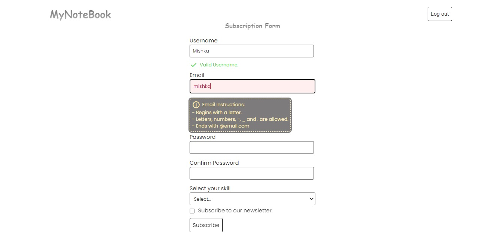
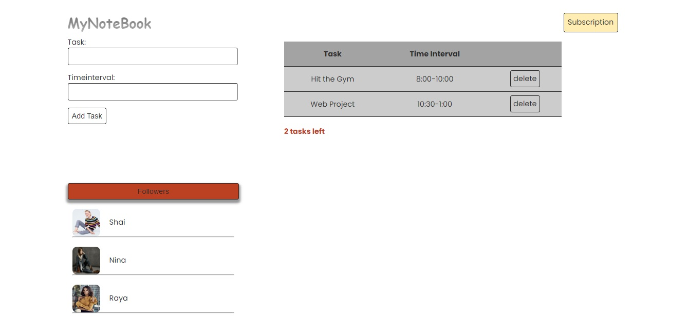

# ReactJS-MultiPageForm-React-Testing-Library (<font size='3'> V1 </font>)

#### By _**Mahashi-github**_

#### This is a ReactJS & Json-Server multipage form application. This application is created in order to being tested by different testing options of 'react-testing-library'.

* Page 1: Subscription Form. 
* Page 2: To-do add-item Form, to-do table and followers list. 

## Technologies Used
* _ReactJS_
* _React-router-dom_
* _React-Hooks (useContext, useEffect, useState)_
* _css_
* _jsx_
* _JSON-Server_
* _React-testing library: act, fireEvent, userEvent, render, screen, within from @testing-library_

## Setup
This react app is created by 'npx create-react-app directoryName'. 

To run this project, install it locally:

First terminal:
```
$ npm install
$ npm start
```
Second terminal:
```
$ npx json-server -w data/db.json -p 8000
```
Third terminal:
```
$ npm test
```

## Screenshots of the Application
<p>
  
  
</p>